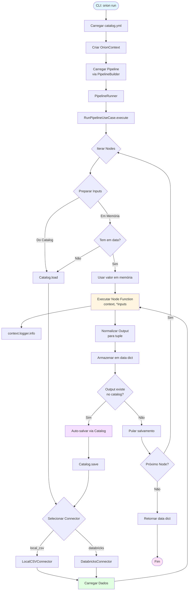
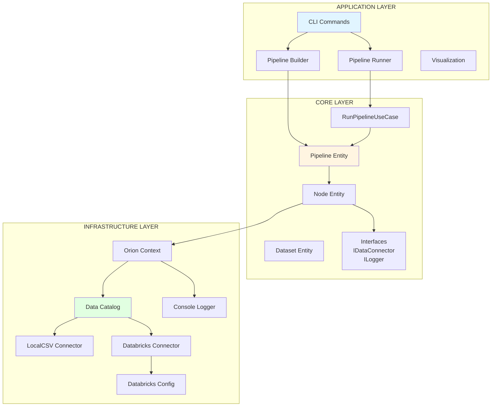
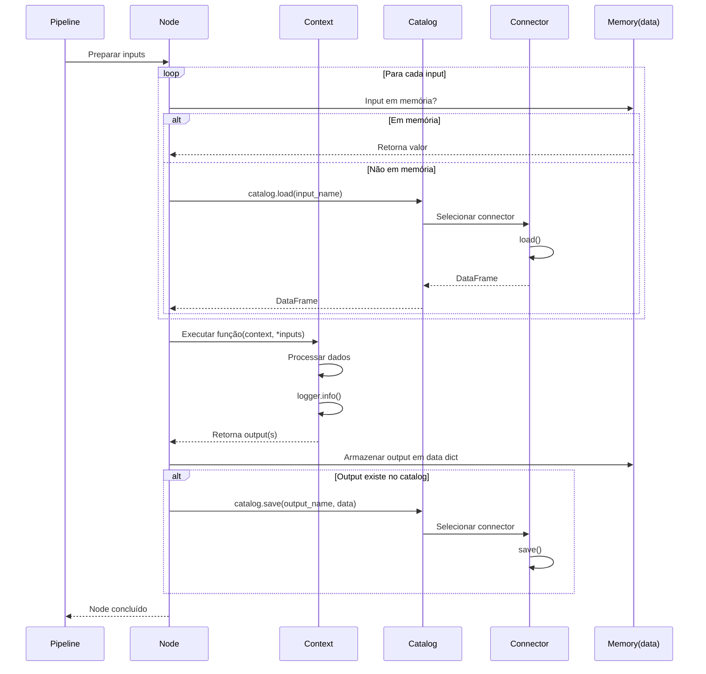
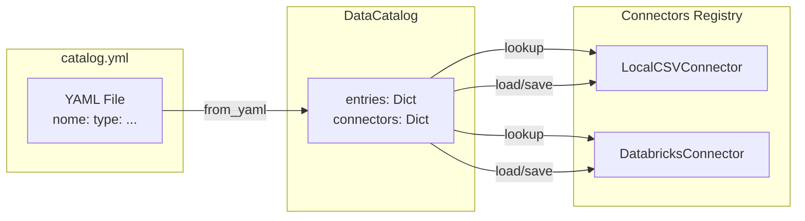
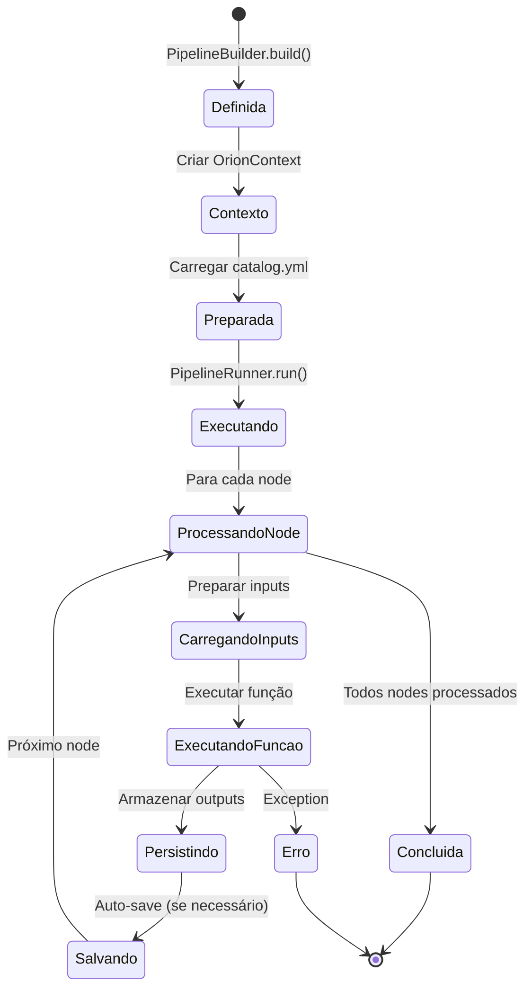
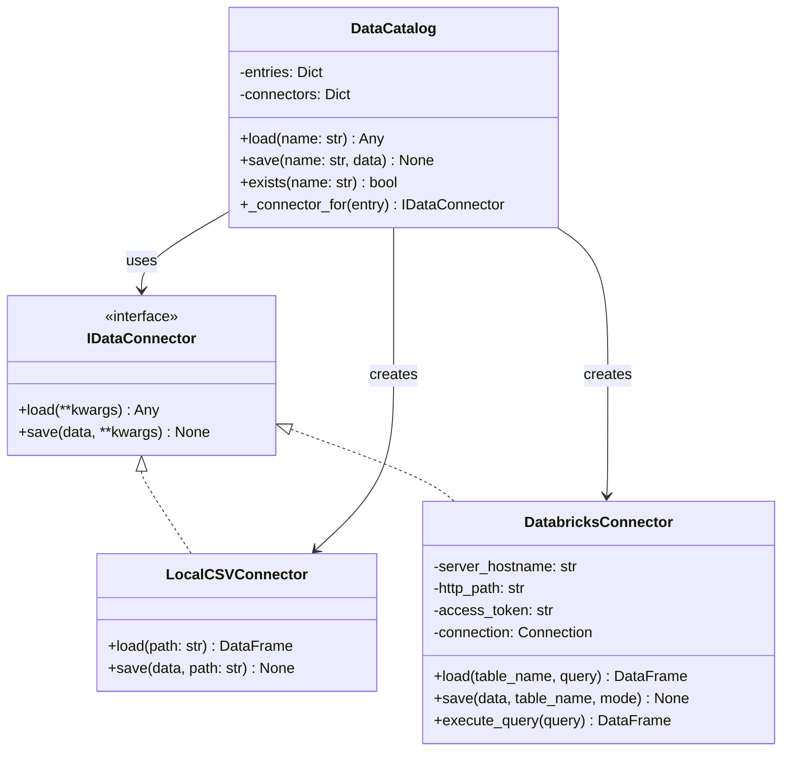
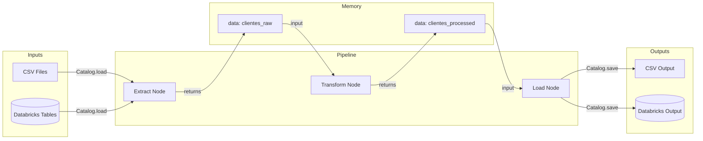
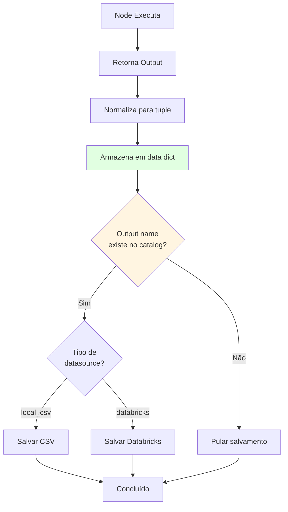
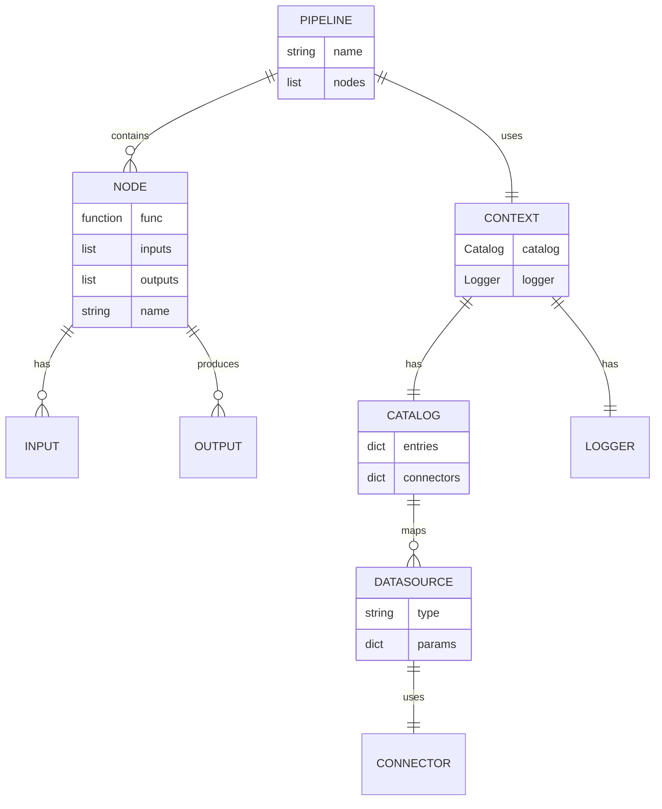
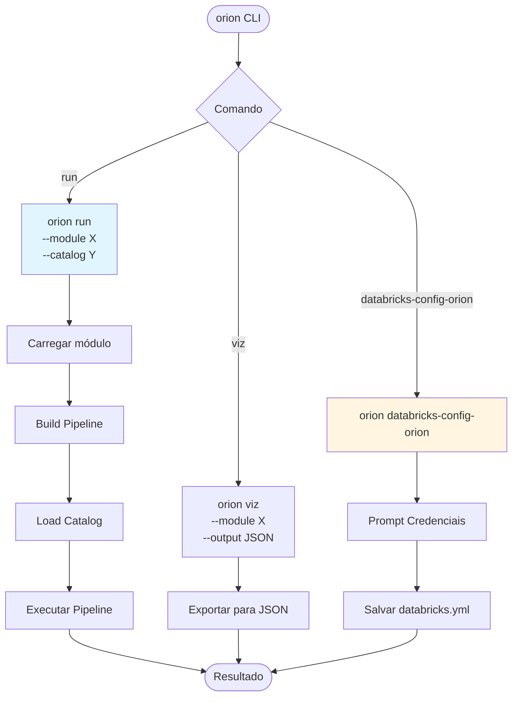

# 📊 Diagramas Mermaid - Oríon Framework

Este arquivo contém todos os diagramas do Oríon Framework em formato Mermaid para fácil visualização e edição.

---

## 🔄 Fluxo de Dados Completo



---

## 🏗️ Arquitetura em Camadas



---

## 🔀 Fluxo de Execução de um Node



---

## 📦 Estrutura de Dados do Catalog



---

## 🎯 Lifecycle de uma Pipeline



---

## 🔌 Sistema de Conectores



---

## 📊 Fluxo de Dados Simplificado



---

## 🧩 Composição de uma Pipeline

```mermaid
graph TB
    subgraph "Pipeline: ingestao_clientes"
        N1[Node: extract<br/>inputs: []<br/>outputs: [clientes_raw]]
        N2[Node: transform<br/>inputs: [clientes_raw]<br/>outputs: [clientes_tratado]]
        N3[Node: load<br/>inputs: [clientes_tratado]<br/>outputs: []]
    end
    
    N1 -->|clientes_raw| N2
    N2 -->|clientes_tratado| N3
    
    style N1 fill:#e1f5ff
    style N2 fill:#fff5e1
    style N3 fill:#ffe1f5
```

---

## 🔄 Auto-Save Mechanism



---

## 📚 Relacionamento entre Entidades



---

## 🚀 CLI Commands Flow



---

## 💾 Estado em Memória Durante Execução

```mermaid
graph TB
    subgraph "Estado Inicial"
        M0[data = {}]
    end
    
    subgraph "Após Node 1"
        M1[data = {<br/>clientes_raw: DataFrame<br/>}]
    end
    
    subgraph "Após Node 2"
        M2[data = {<br/>clientes_raw: DataFrame<br/>clientes_tratado: DataFrame<br/>}]
    end
    
    subgraph "Após Node 3"
        M3[data = {<br/>clientes_raw: DataFrame<br/>clientes_tratado: DataFrame<br/>}]
    end
    
    M0 -->|Node 1 executa| M1
    M1 -->|Node 2 lê clientes_raw| M2
    M2 -->|Node 3 lê clientes_tratado| M3
    
    style M0 fill:#ffe1f5
    style M1 fill:#e1f5ff
    style M2 fill:#e1ffe1
    style M3 fill:#fff5e1
```

---

## Como Usar Estes Diagramas

### Visualizar Online

1. **Mermaid Live Editor**: https://mermaid.live/
   - Cole qualquer diagrama do arquivo
   - Visualize e edite em tempo real

2. **GitHub/GitLab**: 
   - Diagramas Mermaid são renderizados automaticamente em markdown

3. **VS Code**:
   - Instale extensão "Markdown Preview Mermaid Support"

### Exportar como Imagem

1. No Mermaid Live Editor, use o menu de exportação
2. Escolha PNG, SVG ou PDF

### Integrar na Documentação

Os diagramas já estão integrados no `README.md`. Você pode copiar qualquer diagrama deste arquivo e usar onde necessário.

---

## Notas sobre os Diagramas

- **Fluxo de Dados Completo**: Mostra todo o processo desde CLI até finalização
- **Arquitetura em Camadas**: Visualiza as 3 camadas principais
- **Fluxo de Execução de Node**: Sequência detalhada de execução
- **Sistema de Conectores**: Classes e interfaces
- **Auto-Save Mechanism**: Como funciona o salvamento automático
- **Estado em Memória**: Como os dados fluem através da memória

Todos os diagramas são interativos e podem ser modificados conforme necessário.

