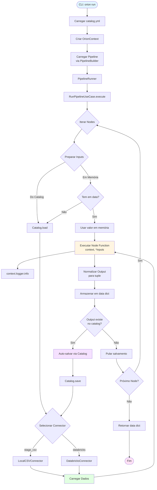

# 🧭 Oríon Framework - Documentação Completa

**Oríon** é um framework de engenharia de dados baseado em **Clean Architecture** e **princípios SOLID**, projetado para criar pipelines de dados legíveis, idempotentes e observáveis.

---

## 📋 Índice

1. [Visão Geral](#visão-geral)
2. [Arquitetura](#arquitetura)
3. [Fluxo de Dados](#fluxo-de-dados)
4. [Guia de Início Rápido](#guia-de-início-rápido)
5. [Conceitos Fundamentais](#conceitos-fundamentais)
6. [Guia de Uso](#guia-de-uso)
7. [API Reference](#api-reference)
8. [Exemplos](#exemplos)

---

## 🎯 Visão Geral

Oríon permite construir pipelines de dados declarativos e type-safe, onde cada etapa (node) pode consumir e produzir dados de forma flexível, com suporte a múltiplos backends de armazenamento através de conectores.

### Características Principais

- ✅ **Clean Architecture**: Separação clara de responsabilidades em camadas
- ✅ **Type Safety**: Type hints obrigatórios e validação automática
- ✅ **Observabilidade**: Logging estruturado e contextual
- ✅ **Extensibilidade**: Conectores plugáveis para diferentes fontes de dados
- ✅ **Idempotência**: Execuções determinísticas e reproduzíveis
- ✅ **Declarativo**: Pipelines definidas de forma simples e legível

---

## 🏗️ Arquitetura

Oríon segue os princípios de **Clean Architecture**, organizando o código em três camadas principais:

```
┌─────────────────────────────────────────────────────────────┐
│                     APPLICATION LAYER                       │
│  ┌──────────────┐  ┌──────────────┐  ┌──────────────┐     │
│  │   CLI        │  │   Runner     │  │   Builder    │     │
│  └──────────────┘  └──────────────┘  └──────────────┘     │
└─────────────────────────────────────────────────────────────┘
                            │
                            ▼
┌─────────────────────────────────────────────────────────────┐
│                       CORE LAYER                            │
│  ┌──────────────┐  ┌──────────────┐  ┌──────────────┐     │
│  │   Pipeline   │  │     Node     │  │  Interfaces  │     │
│  │              │  │              │  │  (Contracts) │     │
│  └──────────────┘  └──────────────┘  └──────────────┘     │
│  ┌──────────────┐  ┌──────────────┐                        │
│  │  Use Cases   │  │   Entities   │                        │
│  └──────────────┘  └──────────────┘                        │
└─────────────────────────────────────────────────────────────┘
                            │
                            ▼
┌─────────────────────────────────────────────────────────────┐
│                  INFRASTRUCTURE LAYER                       │
│  ┌──────────────┐  ┌──────────────┐  ┌──────────────┐     │
│  │  Connectors  │  │   Catalog    │  │   Logging    │     │
│  │  - Local     │  │              │  │              │     │
│  │  - Databricks│  │              │  │              │     │
│  └──────────────┘  └──────────────┘  └──────────────┘     │
│  ┌──────────────┐  ┌──────────────┐                        │
│  │   Context    │  │    Config    │                        │
│  └──────────────┘  └──────────────┘                        │
└─────────────────────────────────────────────────────────────┘
```

### Responsabilidades das Camadas

- **Core**: Contém as entidades de domínio (Pipeline, Node, Dataset) e interfaces (contratos)
- **Application**: Casos de uso, CLI, builders e runners
- **Infrastructure**: Implementações concretas de conectores, logging, persistência

**Regra de Dependência**: Camadas externas dependem apenas de interfaces da camada interna, nunca de implementações concretas.

---

## 🔄 Fluxo de Dados

### Diagrama de Fluxo Completo



### Explicação do Fluxo

#### 1. **Inicialização**
```
CLI → Carrega catalog.yml → Cria OrionContext → Carrega Pipeline
```

#### 2. **Execução de Nodes (Loop Principal)**
Para cada node na pipeline:

1. **Preparação de Inputs**:
   - Verifica se o input está em memória (`data` dict)
   - Se não, carrega do catalog usando o conector apropriado

2. **Execução**:
   - Executa a função do node com `context` e inputs
   - A função pode usar `context.logger` para logging
   - A função retorna um ou mais outputs

3. **Persistência**:
   - Normaliza output para tuple/list
   - Armazena em memória (`data` dict)
   - Se o nome do output existe no catalog, **auto-salva** automaticamente

#### 3. **Conectores e Catalog**
- O `Catalog` atua como uma camada de abstração sobre os conectores
- Cada datasource no `catalog.yml` mapeia para um conector específico
- Os conectores implementam a interface `IDataConnector` (load/save)

#### 4. **Estado em Memória**
- Todos os outputs ficam disponíveis em memória durante a execução
- Nodes subsequentes podem acessar outputs anteriores sem recarregar do storage
- Isso otimiza performance eliminando I/O desnecessário

---

## 🚀 Guia de Início Rápido

### 1. Instalação

```bash
pip install -r requirements.txt
pip install -r requirements_databricks.txt  # Se usar Databricks
```

### 2. Criar uma Pipeline Simples

**catalog.yml**:
```yaml
clientes_raw:
  type: local_csv
  path: data/raw/clientes.csv

clientes_processados:
  type: local_csv
  path: data/processed/clientes_processed.csv
```

**pipeline.py**:
```python
from ...application.pipeline.builder import PipelineBuilder
from ...infrastructure.config.context import OrionContext
from .nodes.extract import extract
from .nodes.transform import transform
from .nodes.load import load

def create_pipeline():
    builder = PipelineBuilder("minha_pipeline")
    builder.add_node(extract, inputs=[], outputs=["clientes_raw"])
    builder.add_node(transform, inputs=["clientes_raw"], outputs=["clientes_processados"])
    builder.add_node(load, inputs=["clientes_processados"], outputs=[])
    return builder.build()
```

**nodes/extract.py**:
```python
def extract(context: OrionContext):
    df = context.catalog.load("clientes_raw")
    context.logger.info(f"Extraídos {len(df)} registros")
    return df
```

### 3. Executar

```bash
orion run \
  --module examples.minha_pipeline.pipeline \
  --catalog catalog.yml
```

---

## 📚 Conceitos Fundamentais

### Pipeline

Uma **Pipeline** é uma sequência ordenada de **Nodes** que digitalm transformam dados. Ela define o fluxo ETL completo.

**Características**:
- Sequência ordenada de nodes
- Execução sequencial (um node por vez)
- Compartilhamento de estado em memória entre nodes

### Node

Um **Node** representa uma etapa de transformação no pipeline. Cada node:
- Tem uma função Python que executa a transformação
- Declara seus inputs (nomes de datasets)
- Declara seus outputs (nomes de datasets)
- Pode ou não persistir dados no catalog

**Assinatura de Função**:
```python
def node_function(context: OrionContext, *inputs) -> Union[Any, Tuple[Any, ...]]:
    # context.logger.info(...)
    # processamento...
    return output  # ou (output1, output2, ...)
```

### Catalog

O **Catalog** é um registro centralizado de todos os datasources disponíveis. Ele:
- Mapeia nomes lógicos para fontes físicas de dados
- Abstrai o tipo de storage (CSV, Databricks, etc.)
- Permite que nodes referenciem dados por nome, não por path

**Estrutura**:
```yaml
nome_dataset:
  type: tipo_conector
  # parâmetros específicos do conector
```

### Context

O **OrionContext** fornece acesso a:
- `context.catalog`: Acesso ao catalog para load/save
- `context.logger`: Sistema de logging estruturado
- `context.config`: Configurações adicionais (futuro)

### Connectors

**Conectores** implementam a interface `IDataConnector` e são responsáveis por:
- Carregar dados de uma fonte específica
- Salvar dados em um destino específico

Conectores disponíveis:
- `LocalCSVConnector`: Arquivos CSV locais
- `DatabricksConnector`: Tabelas/querys do Databricks

---

## 📖 Guia de Uso

### Criando Nodes

#### Node Simples (1 input, 1 output)
```python
def transform(context: OrionContext, df: pd.DataFrame) -> pd.DataFrame:
    df = df.dropna()
    context.logger.info(f"Removidos NaN: {len(df)} linhas restantes")
    return df
```

#### Node Múltiplos Outputs
```python
def split(context: OrionContext, df: pd.DataFrame) -> Tuple[pd.DataFrame, pd.DataFrame]:
    ativos = df[df["status"] == "ativo"]
    inativos = df[df["status"] == "inativo"]
    return ativos, inativos

# No pipeline:
builder.add_node(split, inputs=["clientes"], outputs=["clientes_ativos", "clientes_inativos"])
```

#### Node Sem Inputs (Extract)
```python
def extract(context: OrionContext):
    df = context.catalog.load("clientes_raw")
    return df

# No pipeline:
builder.add_node(extract, inputs=[], outputs=["clientes_raw"])
```

#### Node Sem Outputs (Load)
```python
def load(context: OrionContext, df: pd.DataFrame):
    context.catalog.save("clientes_processados", df)
    context.logger.info("Dados salvos")

# No pipeline:
builder.add_node(load, inputs=["clientes_processados"], outputs=[])
```

### Trabalhando com Catalog

#### Definindo Datasources

**Local CSV**:
```yaml
clientes_raw:
  type: local_csv
  path: data/raw/clientes.csv
```

**Databricks (Tabela)**:
```yaml
clientes_raw:
  type: databricks
  table: clientes
  catalog: hive_metastore  # opcional
  schema: default          # opcional
```

**Databricks (Query)**:
```yaml
clientes_ativos:
  type: databricks
  query: "SELECT * FROM clientes WHERE status = 'ativo'"
```

#### Load e Save em Nodes

```python
def extract(context: OrionContext):
    # Carregar do catalog (automático se input do node)
    df = context.catalog.load("clientes_raw")
    return df

def save_to_db(context: OrionContext, df: pd.DataFrame):
    # Salvar no catalog
    context.catalog.save("clientes_db", df)
```

**Nota**: Se um output do node tem o mesmo nome de um dataset no catalog, ele é **auto-salvo** automaticamente após a execução.

### Logging

Sempre use `context.logger` em vez de `print()`:

```python
def transform(context: OrionContext, df: pd.DataFrame):
    context.logger.info("Iniciando transformação")
    context.logger.debug(f"Shape inicial: {df.shape}")
    
    df = df.dropna()
    
    context.logger.info(
        "Transformação concluída",
        extra={"linhas_antes": len(df), "linhas_depois": len(df)}
    )
    return df
```

### Tratamento de Erros

```python
def transform(context: OrionContext, df: pd.DataFrame):
    try:
        df = df.dropna(subset=["nome"])
        return df
    except KeyError as e:
        context.logger.error(f"Coluna não encontrada: {e}")
        raise ValueError(f"Schema inválido: {e}") from e
```

---

## 🔌 API Reference

### PipelineBuilder

```python
builder = PipelineBuilder(name: str)
builder.add_node(func, inputs: List[str], outputs: List[str], name: str = None)
pipeline = builder.build()
```

### Pipeline

```python
pipeline.run(context: OrionContext) -> Dict[str, Any]
```

### OrionContext

```python
context.catalog.load(name: str) -> Any
context.catalog.save(name: str, data: Any) -> None
context.catalog.exists(name: str) -> bool
context.logger.info(message: str, **kwargs)
context.logger.error(message: str, **kwargs)
context.logger.warning(message: str, **kwargs)
context.logger.debug(message: str, **kwargs)
```

### Catalog

```python
catalog = DataCatalog.from_yaml(path: str, databricks_config_path: Optional[str] = None)
catalog.load(name: str) -> Any
catalog.save(name: str, data: Any) -> None
catalog.exists(name: str) -> bool
```

---

## 💡 Exemplos

Veja a pasta `examples/` para exemplos completos:
- `pipeline_clientes/`: Pipeline ETL completa com CSV
- `databricks_example.py`: Exemplo usando Databricks

---

## 📝 Próximos Passos

- [Guia de Desenvolvimento](../DEVELOPER_GUIDELINES.md)
- [Setup do Databricks](./DATABRICKS_SETUP.md)
- [Exemplos](../examples/)

