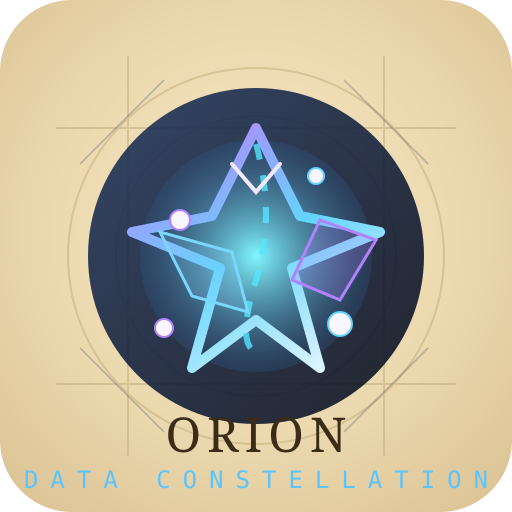

# 🚀 Orion Framework Documentation Portal

  

Orion Framework combina arquitetura em camadas, pipelines orientadas a catálogo e conectores extensíveis para acelerar jornadas de dados. Escolha seu idioma, mergulhe nas áreas-chave e encontre rapidamente guias, tutoriais e referências técnicas.

---

## 🌐 Language Selector · Seletor de Idioma

### 🇬🇧 English

#### 🔰 Getting Started
- [Quickstart](./QUICKSTART.md) — install Orion, run the sample pipeline, understand the catalog.
- [docs/README.md](./README.md) — full overview, design goals, and the execution lifecycle.
- [Get Started Guide (root)](../GET_STARTED.md) — step-by-step onboarding with CLI commands.

#### 🧠 Core Concepts
- [Architecture](./ARCHITECTURE.md) — Clean Architecture layers, SOLID principles, extensibility tips.
- [How It Works](./COMO_FUNCIONA.md) — pipeline flow, context orchestration, autosave logic.
- [Diagrams](./DIAGRAMS.md) — visual maps for entities, connectors, and execution timelines.

#### 🛠️ Tutorials & Examples
- [examples/](../examples) — reference pipelines, including `pipeline_clientes`.
- [exemplo_get_started/](../exemplo_get_started) — runnable end-to-end project with catalog, nodes, and data.
- [docs/EXEMPLO_RAPIDO.md](./EXEMPLO_RAPIDO.md) — quick recipe to customize nodes and outputs.

#### 🔌 Integrations & Ops
- [Databricks Setup](./DATABRICKS_SETUP.md) — credentials, connector configuration, catalog updates.
- [requirements_databricks.txt](../requirements_databricks.txt) — optional dependency bundle.
- [GIT Flow Summary](../GITFLOW_SUMMARY.md) — branch strategy, recommended PR flow.

#### 🤝 Contribute & Support
- [Developer Guidelines](../DEVELOPER_GUIDELINES.md) — code style, testing expectations, PR checklist.
- [AGENTS.md](../AGENTS.md) — contributor guide tailored for automation agents.
- Run smoke tests locally: `python run_tests.py` and `python test_pipeline.py`.

### 🇧🇷 Português

#### 🔰 Primeiros Passos
- [Guia Rápido](./QUICKSTART.md) — instalação, pipeline exemplo e uso do catálogo.
- [README da Documentação](./README.md) — visão completa do framework e fluxo de execução.
- [Guia de Início (raiz)](../GET_STARTED.md) — onboarding detalhado com comandos CLI.

#### 🧠 Conceitos Centrais
- [Arquitetura](./ARCHITECTURE.md) — camadas, princípios SOLID e como estender o núcleo.
- [Como Funciona](./COMO_FUNCIONA.md) — fluxo de dados, contexto, autosave e logging.
- [Diagramas](./DIAGRAMS.md) — mapas visuais de entidades, conectores e execução.

#### 🛠️ Tutoriais & Exemplos
- [examples/](../examples) — pipelines prontos, incluindo `pipeline_clientes`.
- [exemplo_get_started/](../exemplo_get_started) — projeto completo com catalog, nodes e dados.
- [docs/EXEMPLO_RAPIDO.md](./EXEMPLO_RAPIDO.md) — receita rápida para personalizar nodes e outputs.

#### 🔌 Integrações & Operações
- [Configuração Databricks](./DATABRICKS_SETUP.md) — credenciais, conector e ajustes no catalog.
- [requirements_databricks.txt](../requirements_databricks.txt) — dependências opcionais por recurso.
- [GITFLOW_VISUAL.md](./GITFLOW_VISUAL.md) e [GITFLOW_SUMMARY.md](../GITFLOW_SUMMARY.md) — fluxo de versionamento.

#### 🤝 Contribuição & Suporte
- [GUIA_DESENVOLVEDOR.md](./GUIA_DESENVOLVEDOR.md) — padrões de código e dicas para PRs.
- [AGENTS.md](../AGENTS.md) — orientações para agentes e automações.
- Testes recomendados: `python run_tests.py` e `python test_pipeline.py`.

---

## 🧭 Thematic Navigation

| Theme | Key Links |
| --- | --- |
| **Platform Overview** | `core/`, `application/`, `infrastructure/`, [Architecture](./ARCHITECTURE.md) |
| **Pipeline Authoring** | [QUICKSTART.md](./QUICKSTART.md), [EXEMPLO_RAPIDO.md](./EXEMPLO_RAPIDO.md), `examples/` |
| **Operations & Deployment** | [DATABRICKS_SETUP.md](./DATABRICKS_SETUP.md), `requirements_databricks.txt`, [AGENTS.md](../AGENTS.md) |
| **Governance & Workflow** | [GITFLOW_VISUAL.md](./GITFLOW_VISUAL.md), [GITFLOW_SUMMARY.md](../GITFLOW_SUMMARY.md), [Developer Guidelines](../DEVELOPER_GUIDELINES.md) |
| **Visual Assets** | [logo_orion.svg](./logo_orion.svg), [logo_orion_alt.svg](./logo_orion_alt.svg), [logo_orion_origin.svg](./logo_orion_origin.svg) |

---

## 📬 Need More?

- **Discuss & share**: abra uma issue relatando melhorias desejadas ou dúvidas.
- **Request features**: descreva o caso de uso, dados de entrada/saída e conectores.
- **Join roadmap**: contribua com documentação adicionando traduções ou novos tutoriais.

> _Last updated · Última atualização_: 2024. Keep this page in sync when new guides or languages are introduced.
